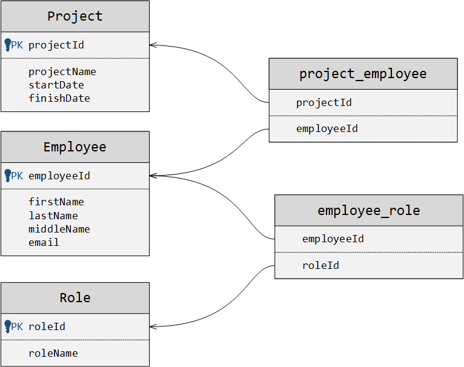
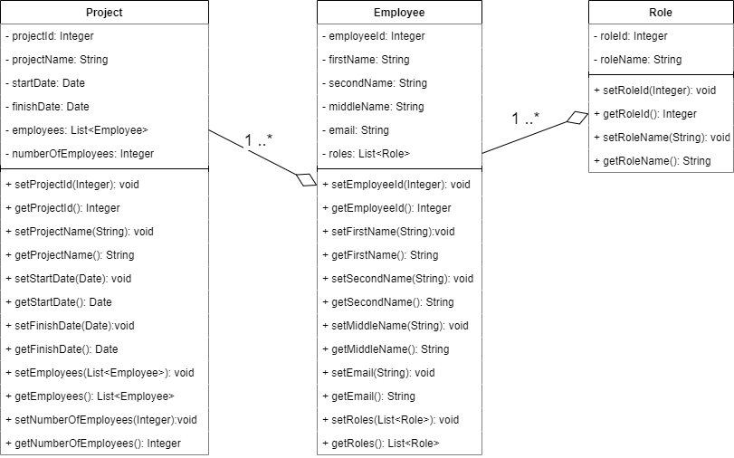
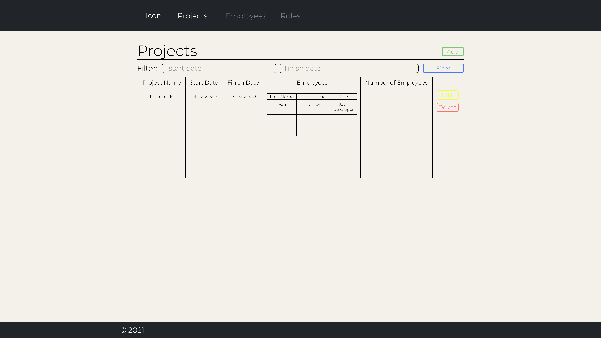
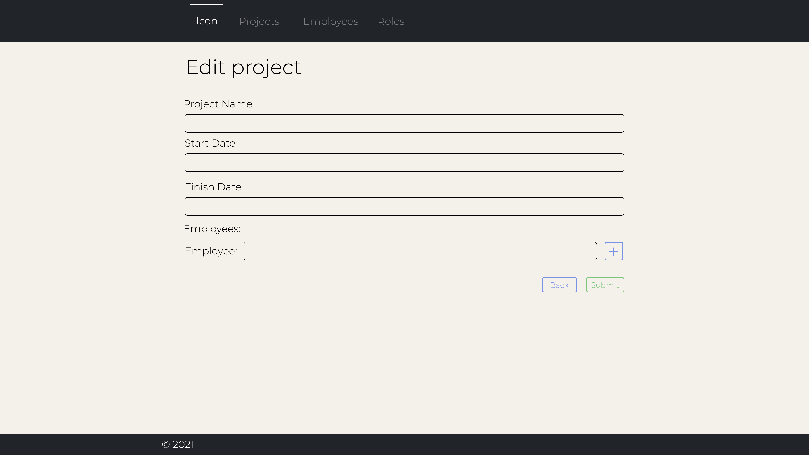
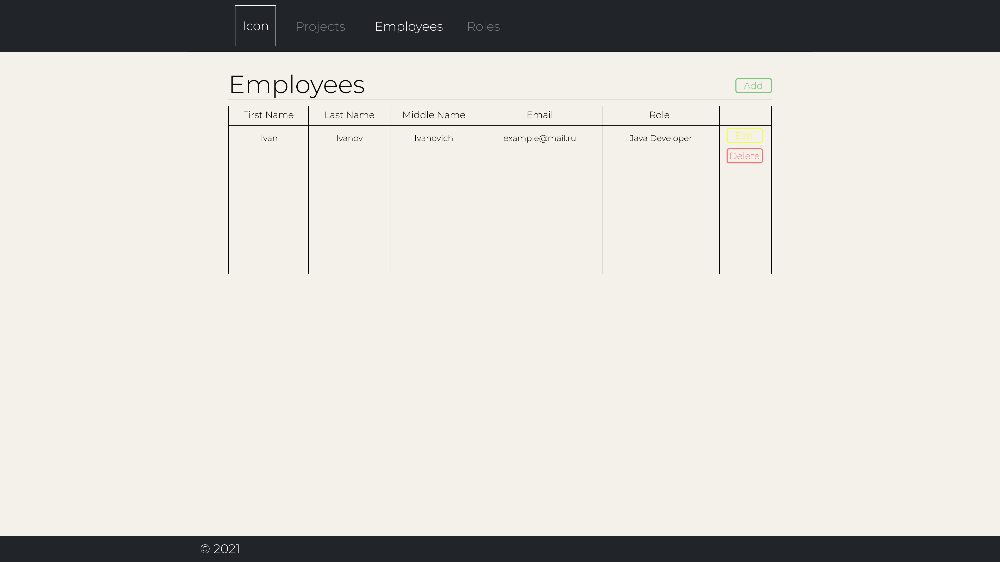
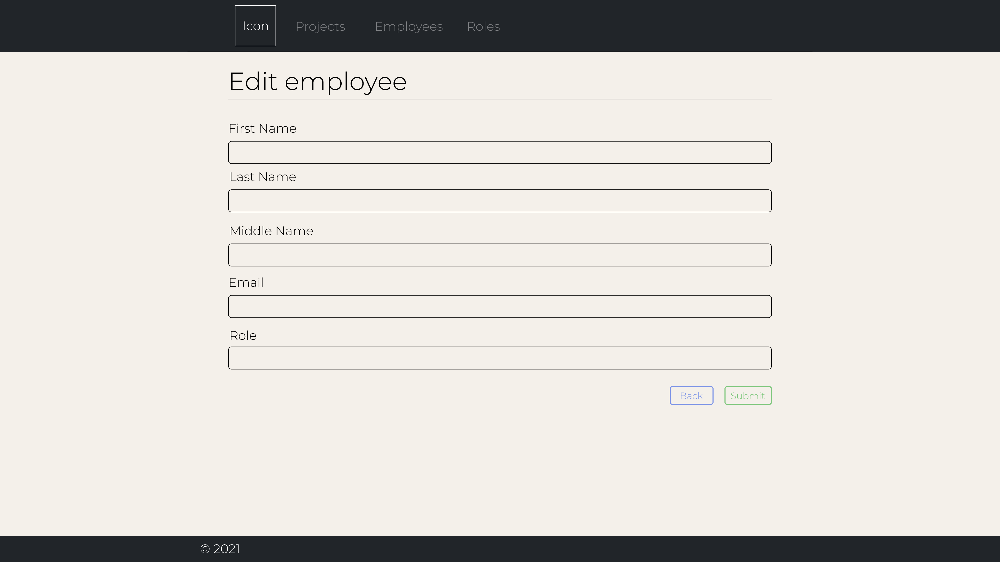
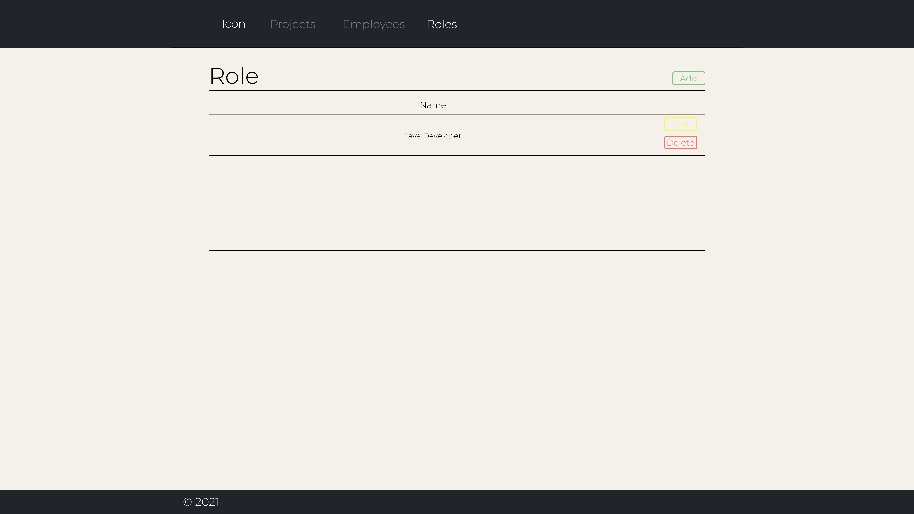
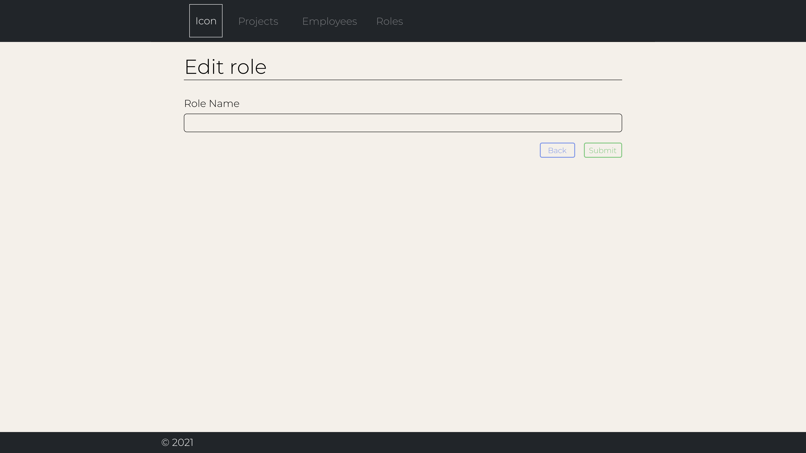

# Software Requirements Specification
## For Project-Employee

Version 0.1  
Prepared by Kiselevich Alexander  

Table of Contents
=================
* 1 [Introduction](#1-introduction)
  * 1.1 [Document Purpose](#11-document-purpose)
  * 1.2 [Product Scope](#12-product-scope)
  * 1.3 [Definitions, Acronyms and Abbreviations](#13-definitions-acronyms-and-abbreviations)
  * 1.4 [References](#14-references)
* 2 [Product Overview](#2-product-overview)
  * 2.1 [Product Perspective](#21-product-perspective)
  * 2.2 [Product Functions](#22-product-functions)
  * 2.3 [Product Constraints](#23-product-constraints)
  * 2.4 [User Characteristics](#24-user-characteristics)
  * 2.5 [Assumptions and Dependencies](#25-assumptions-and-dependencies)
* 3 [Requirements](#3-requirements)
  * 3.1 [External Interfaces](#31-external-interfaces)
    * 3.1.1 [User Interfaces](#311-user-interfaces)
    * 3.1.2 [Hardware Interfaces](#312-hardware-interfaces)
    * 3.1.3 [Software Interfaces](#313-software-interfaces)
  * 3.2 [Functional](#32-functional)

## 1. Introduction

### 1.1 Document Purpose
This SRS describes the software functional and nonfunctional requirements for Project and Human resource management system. This document is intended to be used by the members of the project team that will implement and verify the correct functioning of the system.

### 1.2 Product Scope
Project and Human resource management system allows you to manage the belonging of personnel to a particular project. It should have three objects: "Project", "Employee" and "Role", related as many to many.

### 1.3 Definitions, Acronyms and Abbreviations
MVC -(Model-View-Controller) MVC is an application design model comprised of three interconnected parts. They include the model (data), the view (user interface), and the controller (processes that handle input).  
REST-request - Representational state transfer (REST) is a software architectural style that defines a set of constraints to be used for creating Web services. Web services that conform to the REST architectural style, called RESTful Web services, provide interoperability between computer systems on the Internet. RESTful Web services allow the requesting systems to access and manipulate textual representations of Web resources by using a uniform and predefined set of stateless operations.  
CRUD operations - Create, read, update, delete.

### 1.4 References

## 2. Product Overview

### 2.1 Product Perspective
This is a simple Project and Human resource management system that allows you to interact with three entities: "Project", "Employee" and "Role". Database Organization Scheme:  

### 2.2 Product Functions
Functions available to the user:  

* Creation of a new project.  
* View project information.
* View project information by start and finish date.  
* Editing project information.  
* Deleting project information.  
* Create a new employee.  
* View employee information.  
* Editing employee information.  
* Delete employee information. 
* Create a new role.  
* View role information.  
* Editing role information.  
* Delete role information.  

### 2.3 Product Constraints
Developing application should be based on the MVC architectural pattern in Java, run on Apache Tomcat and run in a browser.

### 2.4 User Characteristics
Entity class diagram:

### 2.5 Assumptions and Dependencies
Dependencies:  

* postgresql
* spring-core
* spring-web
* spring-webmvc  

## 3. Requirements

### 3.1 External Interfaces
When entering the date of start or finish in the startDate or finishDate field when creating or editing information about the project, the input format should be as follows: DD-MM-YYYY. Example: "15-02-2000"  

#### 3.1.1 User interfaces
HTML Template: [Link](https://brest-java-course-2021.github.io/akiselevich/home_projeect/documentation/html_template/projects.html)

* **Projects Mockup**

* **Edit Project Mockup**

* **Employees Mockup**

* **Edit Employee Mockup**

* **Roles Mockup**

* **Edit Role Mockup**

#### 3.1.2 Hardware interfaces
The interaction between the user interface and the server will be carried out using rest requests. Data will come in JSON format.

#### 3.1.3 Software interfaces
The application must be running on the Tomcat server. Use PostgreSQL as a database. Use Java programming language and Spring Framework. To build the project use Maven. For version control use Git.

### 3.2 Functional   
* **Creation of a new project.**  
The user fills out a form to create information about the new project and presses the confirm button. A POST request is sent to the server, and data is validated. if the data is correct a new record is created in the database.  
* **View project information.**  
When you enter the form to view information about the projects, a GET - request is sent to the server. The server sends information in JSON format in response. Information is filled in on the form.  
* **View project information by start and finish date**
The user fills out startDate and/or finishDate field in form to filter information about the projects, a GET - request is sent to the server with startDate and finishDate params. The server sends information in JSON format in response. Information is filled in on the form.
* **Editing project information.**  
The user fills out a form for editing project information and clicks on the confirm button. A PUT - request is sent to the server and the data is validated. if the data is correct, the record in the database is edited.  
* **Deleting projects information.**  
The user enters the projectId of the project which information he wants to delete. Presses the confirm button. A DELETE - request is sent to the server. The server is checking projectId. If information about this project exists, it will be deleted; if information about this project does not exist, the server will return a message about incorrect data.  
* **Create a new employee.**  
The user fills out a form to create information about a new employee and clicks the confirm button. A POST - request is sent to the server, and the data is verified. If the data is correct, a new record is created in the database.  
* **View employee information.**  
When you enter the form to view information about employees, a GET - request is sent to the server. The server sends information in JSON format in response. Information is filled in the form.
* **Editing employee information.**  
The user fills out a form for editing employee information and presses the confirmation button. PUT - the request is sent to the server and the data is checked. if the data is correct, the record in the database is edited.  
* **Delete employee information.**  
The user enters employeeId, the information about which he wants to delete. Presses the confirm button. DELETE - the request is sent to the server. The server checks employeeId. If information about this employee exists, it will be deleted; if information about this employee does not exist, the server will return a message about incorrect data.
* **Create a new role**  
The user fills out a form to create information about a new role and clicks the confirm button. A POST - request is sent to the server, and the data is verified. If the data is correct, a new record is created in the database.  
* **View role information.**  
When you enter the form to view information about roles, a GET - request is sent to the server. The server sends information in JSON format in response. Information is filled in the form.
* **Editing role information.**  
The user fills out a form for editing role information and presses the confirmation button. PUT - the request is sent to the server and the data is checked. if the data is correct, the record in the database is edited.  
* **Delete role information.**  
The user enters roleId, the information about which he wants to delete. Presses the confirm button. DELETE - the request is sent to the server. The server checks roleId. If information about this role exists, it will be deleted; if information about this role does not exist, the server will return a message about incorrect data.
